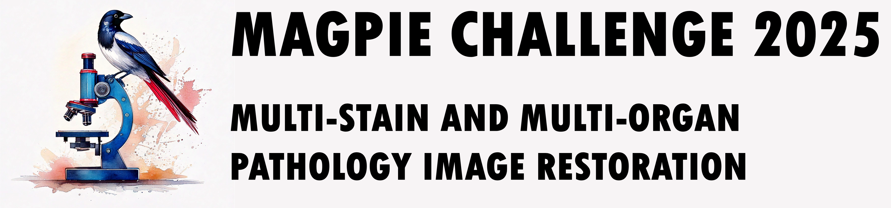

# MAGPIE2025

MAGPIE: MULTI-STAIN AND MULTI-ORGAN PATHOLOGY IMAGE RESTORATION CHALLENGE (2025)

# Environment Setup

### Conda environment

```bash
conda create -n magpie python=3.10
conda activate magpie
pip install -r requirements.txt
```

### Docker Image

```bash
sudo docker pull keunhobyeon/magpie2025:latest
```

* Note: Patch generation and evaluation will be executed within this environment.

# Dataset

The dataset is provided as .svs Whole Slide Images (WSIs).  
Note: The test set patches are generated using following commands.

### Extract Patches

Patch extraction methods differ based on stain types:

1. H&E and IHC Stains  
   The patch extraction code for these stains is implemented based on the following paper:  
   Lu, Ming Y., et al. "Data-efficient and weakly supervised computational pathology on whole-slide images." Nature Biomedical Engineering 5.6 (2021): 555-570.
2. Special Stains  
   For special stains, a custom patch extraction method is used.

To extract image patches from Whole Slide Images (WSIs), run the following command:

```bash
cd make_patches
git clone https://github.com/mahmoodlab/CLAM
python make_patches.py --source_dir "SLIDE_DIR" --save_dir "PATCH_SAVE_DIR"
cd ../
```

### Data Folder Structure

```
DATA_ROOT_DIR/  
    ├── train/  
    │   ├── blur/  
    │   │   └── Slide_1/  
    │   │       ├── 1um/  
    │   │       │   ├── Slide_1_4656_41216.png  
    │   │       │   ├── Slide_1_4656_41728.png  
    │   │       │   └── ...  
    │   │       ├── 2um/  
    │   │       │   └── ...  
    │   │       ├── 3um/  
    │   │       │   └── ...  
    │   │       └── 4um/  
    │   │           └── ...  
    │   └── gt/  
    │       └── Slide_1/  
    │           └── 0um/  
    │               ├── Slide_1_4656_41216.png  
    │               ├── Slide_1_4656_41728.png  
    │               └── ...
    └── val/
        ├── blur/
        └── gt/
```

# Sample inference code

### Installation

This sample inference code is implemented based on the following paper:
Yue, Zongsheng, Jianyi Wang, and Chen Change Loy. "Resshift: Efficient diffusion model for image super-resolution by residual shifting." Advances in Neural Information Processing Systems 36 (2024).

```bash
git clone https://github.com/zsyOAOA/ResShift
```

#### Copy python scripts to run inference

```bash
cp -r inference_sample/code/* ResShift/
```

#### Download Model Weights

1. Download the pre-trained VQGAN model weight ("autoencoder_vq_f4.pth") from the [ResShift GitHub repository](https://github.com/zsyOAOA/ResShift) and save it in the inference_sample/weights directory.
2. Download "model_400000.pth" from [this link](https://github.com/KeunhoByeon/MAGPIE2025/releases/tag/v1.0) and save it in the inference_sample/weights directory.

#### Setup environment

```bash
/bin/bash setup.sh
```

### Run inference

#### Restart Docker

```bash
sudo systemctl restart docker
```

#### Set your data path as follows

```bash
export DATA_PATH="YOUR_DATA_PATH"
```

#### Run inference inside the container

```bash
sudo docker run --rm --gpus all --network=host --privileged \
-v .:/workspace \
-v "$DATA_PATH":/data \
-it magpie2025 \
python ./ResShift/inference.py
```

# Evaluation code

#### Run evaluation

```bash
python evaluation.py --gt_dir "YOUR_GT_PATH" --pred_dir ./results/test/blur
```

See "evaluation.py" for more detail.

```python
import lpips

from skimage.metrics import peak_signal_noise_ratio, structural_similarity

lpips_loss = lpips.LPIPS(net='vgg').cuda()


def calcualte_psnr(pred, gt):
    psnr_score = peak_signal_noise_ratio(pred, gt)
    return psnr_score


def calcualte_ssim(pred, gt):
    ssim_score = structural_similarity(pred, gt, channel_axis=2)
    return ssim_score


def calcualte_lpips(pred, gt):
    lpips_score = lpips_loss(lpips.im2tensor(pred).cuda(), lpips.im2tensor(gt).cuda()).item()
    return lpips_score
```

